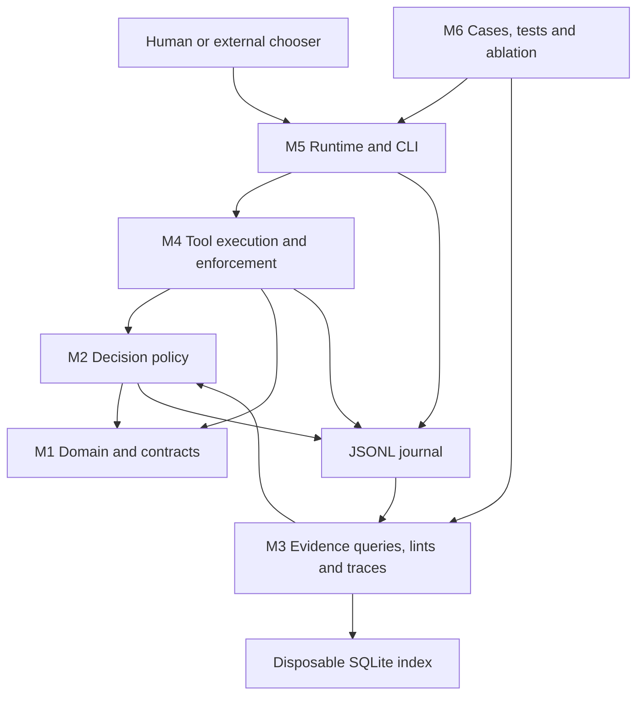
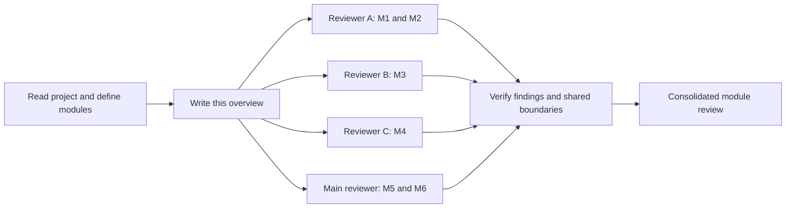

# Ancient Games: project map and module review

Reviewed snapshot: commit `33a114b`, 2026-09-10. This document describes the current implementation;
`SPEC.md`, `DECISIONS.md`, and the design/ablation documents explain its evolution.
The module boundaries below are logical review boundaries, not a proposed directory rewrite.

## Purpose and execution model

Ancient Games is a standard-library Python framework for governing agent work.
It decides when to delegate, require approval, corroborate evidence, filter
candidates, and accept a plan. Judgment is supplied by a caller; the framework
does not itself call an LLM. Its hybrid layer lets a caller choose tools in a
bounded loop, with checks before execution and a journal for subsequent checks
and reporting. An external chooser command can drive supervised runs.

The five decision stages are C Gate(task), D Guard(action), B
Corroborate(claims), E Filter(candidates), and A Prove(plan). The hybrid runtime
suggests a stage sequence but allows iteration, including test/localize/retry.
Dispatch records a delegation contract; an outside orchestrator performs the
agent work and supplies its return.

## Modules

| ID | Module | Main files | Responsibility |
| --- | --- | --- | --- |
| M1 | Domain and contracts | `ancient_games/ctx.py`, `schema.py`, `hybrid/types.py` | Shared context, artifact and tool types, field predicates, dispatch/return contracts, argument hydration. |
| M2 | Decision policy | `ancient_games/registry.py`, `stages.py` | Artifact stakes and ownership, five stages, source counting, filtering and plan decisions. |
| M3 | Evidence storage and validation | `ancient_games/journal.py`, `index.py`, `lints.py`, `trace.py` | Run-scoped JSONL events, derived SQLite queries, lint findings and human-readable traces. |
| M4 | Tool execution and enforcement | `ancient_games/hybrid/registry.py`, `invariants.py`, `tools/*.py` | Tool discovery, pre-execution checks, evidence adapters, completion checks and Git commit boundary. |
| M5 | Runtime and operator interface | `ancient_games/hybrid/loop.py`, `autonomy.py`, `supervise.py`, `cli.py`, `__main__.py` | Choosing/executing calls, budgets, pauses, preauthorizations, persistence, CLI and supervision. |
| M6 | Verification and experiments | `ancient_games/hybrid/runner.py`, `tests/`, `ablation/`, `docs/`, `README.md`, `pyproject.toml` | Scripted/replay cases, regressions, live-run scoring, project setup and design records. |

`TaskInput`, `ActionInput`, `Claim`, `ClaimResult`, and `Plan` currently live in
`stages.py` and belong to M2 in this map. M1 supplies the shared contracts they
use; these logical boundaries do not imply those classes have been relocated.

## How a run works

1. The CLI initializes a manifest, saved context, and journal configuration.
   The manifest identifies the working directory and tool directories.
2. The runtime observes context and journal events. A scripted caller or external
   chooser selects a tool; the suggested stage order is guidance.
3. The shared `loop.step` checks applicable invariants, executes or declines
   the call, and appends its outcome. Adapters invoke the policy functions and
   append their evidence or decision events.
4. Dispatch writes a delegation record. An external orchestrator runs the worker;
   `ingest_return` imports its return and records the supplied claims/checks.
5. Corroboration evaluates evidence; proof reconstructs a plan and runs lints.
   Commit performs the Git operation, and done checks completion. The caller can
   iterate until completion, a pause, no choice, or the call ceiling.

This describes the intended flow. The review below identifies places where
the checks do not yet reliably enforce it.

## Dependency and data flow

This diagram shows logical dependencies and data flow, not every Python import.



The JSONL journal is the durable evidence record; SQLite is rebuildable. Context
also lives in a separate JSON file for CLI runs. A run manifest points to the
journal, context, working directory and tool directories. These state boundaries
matter when reviewing restart behavior and approval freshness.

Tools are trusted Python code loaded from configured directories. Manifest side
effects and invariant checks are a protocol boundary, not an operating-system
sandbox. Direct filesystem access and operator-written approval events remain
outside that boundary. Review claims must respect this intended trust model.

## Review workflow

A dependency graph suits this review better than reviewing every module in one
serial loop. Three parallel reviewers cover coherent branches, then the main
reviewer checks interactions and consolidates evidence:



Each module gets a serious-issue assessment and one concrete simplification.
Findings require a reachable trigger, impact, source location and preferably an
isolated reproduction. Passing tests establish a baseline, not absence of bugs.
Review does not authorize implementing the suggested code changes.

The review graph organizes independent reading and a final integration check;
the project's execution remains an observe/choose/execute loop. If a future fix
changes a shared contract, re-review that module and its affected consumers.
Otherwise, stop when every module has an assessment, evidence for reported
defects, and one testable simplification.

## Running and reading the project

From the repository root:

```bash
python3 -m pytest -q
python3 -m ancient_games.hybrid --help
python3 -m ancient_games.hybrid tools --schema
```

Python 3.10 or newer is declared; pytest is the test dependency. Git is also
needed for repository fixtures and commit operations. Start with this map and
the code; consult `docs/HYBRID_SPEC.md` and `docs/AUTONOMY_DESIGN.md` for the newer
layers. The README's original module list and 68-test count are historical.

## Review results

The project has clear policy concepts, small tool adapters, extensive regression
fixtures, and useful separation between recorded evidence and a derived index.
Its main weakness is inconsistent interpretation of the same evidence across
source counting, plan reconstruction, tool outcomes, and runtime state.

Three subagents reviewed M1/M2, M3, and M4 in the first pass. On the requested
retry, two fresh reviewers rechecked M1/M2 and completed the M4 review in
parallel; the main reviewer rechecked evidence, runtime, replay, and shared
boundaries. The retry reconfirmed the earlier behaviors, qualified F1's contract
interpretation, and added F10/F11. These are findings from the inspected paths,
not a claim of exhaustive verification.

A final coverage audit paired M1–M3 and M4–M6 across two parallel reviewers,
with the main reviewer checking the architecture and consolidating the result.
Every module now has an assessment and an acceptance check for its suggested
simplification. That audit inspected unchanged source and reused the previous
reproductions and test results; it did not rerun them.

Severity: **P1** means a core correctness guarantee can fail through supported
tool calls; **P2** means a reachable reliability or verification defect. All
numbered behaviors below were reproduced, with high confidence; F1's intended
policy needs clarification, and F9 concerns custom replay assertions. No finding
assumes malicious Python plugins or concurrent journal writers.

### Assessment of every module

| Module | What works well | Review conclusion |
| --- | --- | --- |
| M1 Domain and contracts | Shared dataclasses and data-driven field tables make dispatch contracts inspectable. | F8: structural validation is incomplete, so malformed nested inputs can fail before journaling. No separate serious schema-table defect was established. |
| M2 Decision policy | Named stage functions and a data-only stakes registry make decisions traceable. | F2: unresolved claims can disappear at plan reconstruction. F1 exposes an ambiguous independence contract; stale cap state also needs correction. |
| M3 Evidence storage and validation | Run-scoped JSONL reads, rebuildable SQLite indexes, and a differential backend support audit and comparison. | F5: malformed returns can prevent further proof. F10: parsing presentation text can lose a cap. The Python/SQL disposition predicates also disagree on Unicode whitespace. |
| M4 Tool execution and enforcement | Small adapters reuse policy functions; discovery validates manifests and a shared entrypoint. | Highest-priority repair area: F11 checks different content from what Git commits; F3 miscounts active workers; F4 accepts an older proof. F2/F5/F8/F10 cross this boundary. |
| M5 Runtime and operator interface | The CLI and supervisor reuse `loop.step`; pause and call-budget decisions use journal history. | F6/F7: success and terminal-state interpretations disagree across entry points. These are lifecycle defects, not reasons to replace the runtime loop. |
| M6 Verification and experiments | Scripted cases, replay, regression fixtures, and ablation scoring cover both intended flows and past failures. | F9 affects unsupported custom replay status assertions; shipped UC8 asserts explicit outcomes. The color fixture depends on ambient environment, and passing tests miss the documented interactions. |

The following findings supply the evidence for these assessments. The
simplification table near the end gives one bounded change and acceptance check
per module.

### Serious findings

| ID | Priority | Module | Finding and source |
| --- | --- | --- | --- |
| F1 | P1 | M2 | One author can supply multiple supposedly independent sources. `ancient_games/stages.py:359`, mirrored in `index.py:210`. |
| F2 | P1 | M2/M4 | A later empty corroboration removes an unresolved claim from proof. `hybrid/tools/_plan.py:64`, `:98`, `:105`. |
| F3 | P1 | M4 | Repeated or unmatched returns incorrectly free dispatch slots. `hybrid/tools/_shared.py:141`, `tools/ingest_return.py:82`. |
| F4 | P1 | M4 | Completion can reuse an old passing proof after a newer proof fails. `hybrid/tools/done.py:81`. |
| F5 | P2 | M3/M4 | A malformed FOLLOW_ON entry prevents subsequent linting and proving. `hybrid/tools/ingest_return.py:75`, `lints.py:61`, `index.py:152`. |
| F6 | P2 | M4/M5 | A successful completion carrying deferrals is interpreted as unsuccessful. `hybrid/tools/done.py:109`, `tools/_shared.py:122`, `supervise.py:53`. |
| F7 | P2 | M5 | The CLI accepts work after completion while status still reports DONE. `hybrid/cli.py:385`, `supervise.py:53`. |
| F8 | P2 | M1/M4 | Malformed artifact paths crash before the attempted call is journaled. `ctx.py:86`, `hybrid/types.py:82`, `invariants.py:120`. |
| F9 | P2 | M6 | Replay silently ignores an explicitly expected final status. `hybrid/runner.py:140`. |
| F10 | P1 | M3/M4 | A colon in a claim ID loses its evidence cap during plan reconstruction. `trace.py:15`, `hybrid/tools/_plan.py:103`. |
| F11 | P1 | M4 | Commit checks can miss staged changes that Git actually commits. `hybrid/tools/_shared.py:154`, `invariants.py:66`, `tools/commit.py:62`. |

Paths beginning `hybrid/` and bare core filenames are relative to
`ancient_games/`; `tools/` abbreviates `ancient_games/hybrid/tools/`.
Line numbers refer to this review snapshot.

#### F1: repeated framing labels inflate independence

Trigger: dispatch one researcher, then use `record_claim` to record the same
judgment claim from that author under framings `f1`, `f2`, and `f3`. Under an R1
governance task, `corroborate` reports `C1: n=3/3` with only one dispatched
researcher. The records can even cite the same evidence reference.

The specification is inconsistent here: `SPEC.md:143` explicitly counts distinct
framings, while `SPEC.md:149` says one author contributes at most one source
across categories (a)/(b). `DECISIONS.md` decision 48 describes that addition
primarily as preventing MAIN from being counted in both categories. The code
implements framing counting; interpreting the result as three independent
authors would be incorrect. This is a confirmed independence-contract concern,
rather than an unambiguous violation of every reading of the spec. It does not
itself clear the separate owner-approval requirement. Define author uniqueness
explicitly and align Python, SQL, and the written contract with that decision.

#### F2: omission can turn failed proof into passing proof

Reproduced sequence:

1. Gate a task and guard action `change` on `engine/x.py`.
2. Record executable C1, with no claim-specific checks.
3. Corroborate C1 for `change`: `n=0/2, capped`.
4. Prove: `FAIL`, requiring a claim-specific check for C1.
5. Corroborate `{"action":"change","claims":[]}`.
6. Prove: `PASS`, with no new evidence.

Historical coverage still remembers C1, but plan reconstruction uses only the
latest corroboration call's claim list. Reconstruct the current result per
recorded claim, and reject covered claims that have no corresponding plan entry.
A partial refresh must not erase an unresolved obligation.

#### F3: dispatch capacity is arithmetic rather than identity-based

Dispatch A/B/C; D is correctly refused by I5. `ingest_return` for MAIN then
succeeds despite MAIN having no dispatch, and D is admitted. Returning A twice
also succeeds and permits E/F: B/C/D/E/F remain outstanding, while the counter
reports only three live dispatches.

Even an ordinary retry of an already ingested return can cause this defect.
Track outstanding dispatch identities; only the first matching return or failure
should close a slot. MAIN's own evidence should not subtract a worker slot.

#### F4: an older PASS survives a newer failed proof

Using the UC1 fixture, execute through its successful proof and commit. Record
a new claim without corroborating it, then prove again: the result is
`RETURN_TO_PLANNER`. Calling `done` nevertheless returns
`ToolResult(ok=True, value='DONE', reason=None)`.

`done` selects the most recent PASS, rather than requiring the latest proof
attempt to pass. Its freshness check also considers only tools marked `mutate`,
so evidence changes do not invalidate the old proof. Require the latest proof
to pass and bind it to the evidence/plan state being completed.

#### F5: malformed return data poisons a run

This accepted tool input is sufficient:

```json
{"agent_id":"MAIN","fields":{"CLAIMS":[],"FOLLOW_ON":[null]}}
```

Every subsequent `run_lint` and `prove` fails with
`internal-error: 'NoneType' object is not subscriptable`, under Python, SQL, and
differential backends. Appending a corrected return does not recover the run,
because readers revisit the malformed historical entry.

Validate the complete return structure before appending it. Historical malformed
entries should produce a named finding rather than crashing the whole reader.

#### F6: successful completion and journal success disagree

With an outstanding `deferred_decision`, `done` returns `ok=True` and
`value='DONE'`, with an explanatory `reason`. The journal helper `event_ok`
requires `reason is None`, so the supervisor reports `RUNNING`, not
`DONE_WITH_DEFERRALS`. A reproduced drive invocation executed `done` repeatedly
instead of recognizing completion.

Persist success explicitly, separately from informational diagnostics, and use
that outcome consistently in the loop, supervisor, case runner, and scorer.
Existing tests exercise the successful tool result and synthetic terminal
events separately, which misses this integration defect.

#### F7: completion is not enforced consistently across entry points

Complete UC1, then invoke `cli.main` with `call dispatch` on its manifest. The
call exits 0 and succeeds, but `terminal_state` still returns `DONE` because it
finds an earlier successful completion anywhere in the journal. Consumers can
therefore observe a completed run with newly outstanding work.

Use one terminal-state policy before accepting additional execution through
the CLI, loop, and supervisor. Reopening a completed run should be explicit,
with its previous completion no longer treated as current.

#### F8: type annotations do not validate input

An ordinary guard argument with `{"path":null,"mode":"mutate"}` reaches
registry matching and raises `AttributeError: 'NoneType' object has no attribute
'startswith'`. The reproduction records zero journal events. Hydration accepts
the invalid scalar, and invariant evaluation occurs outside the tool adapter's
exception handling.

Validate nested input types before invariant evaluation and record a structured
decline. This is a malformed-input reliability issue, not an observed approval
bypass.

#### F9: replay can pass without satisfying its stated final outcome

`runner.compare({"expected_final":{"status":"DONE"}}, [], None)` returns
`[]`, meaning no mismatches. Replay always supplies `status=None`, and the
comparison skips the expected status in that case. A status-only replay can
therefore pass with an empty journal. Cases with additional event assertions
are less exposed.

The shipped UC8 replay uses explicit `tool_outcomes` for proof and completion
and does not request `status`; this reproduction does not invalidate UC8's
existing coverage. Derive observable completion from journal events in both
modes, or explicitly reject unsupported replay assertions rather than silently
ignoring them.

#### F10: a display parser changes the proof result

Repeat F2's setup through the first corroboration, using `change:C1` as the
claim ID. Corroboration correctly reports `n=0/2, capped`, but the very first
proof returns PASS. With the otherwise identical ID `C1`, proof correctly fails.
Both outcomes were reproduced under Python, SQL, and differential backends.

The trace parser excludes colons from claim IDs. `_plan._claims_for` cannot find
the parsed row and silently defaults to one required source with no cap. Thus
an accepted identifier changes an evidence requirement through a display-format
limitation. Store structured corroboration results for plan reconstruction and
report missing results as findings. As an immediate containment measure, reject
unrepresentable IDs consistently at admission rather than treating parse failure
as sufficient evidence. This is separate from F2: no later omission is required.

#### F11: checked paths differ from the contents Git commits

In a disposable repository, stage a change to owner-gated `eval/protocol.json`,
then restore only its working copy to HEAD. Git reports `MM`: the index still
contains the change, while the working file matches HEAD. The framework's
`changed_files()` returns `[]` because it compares the working tree to HEAD and
adds untracked paths, without separately accounting for the index.

With an ordinary checkpoint approval, but no guard or owner approval, the
framework's commit tool succeeds and commits the changed protocol from the
index. This was reproduced through `loop.step`, and the resulting committed
file was inspected. No mutation of the actual project repository was involved.

Compute and validate the actual proposed commit contents, including existing
staged changes, before committing. Guard coverage, owner checks, and
preauthorization scope must inspect the same contents that the commit records.
Preserve existing staged work when defining how automatic staging should behave.

### Additional verified edge cases

- **M3 backend disagreement:** a FOLLOW_ON disposition `escalated:\u00a0`
  (a nonbreaking space as the entire owner) produces a Python lint, no SQL lint,
  and an internal divergence error in differential mode. The SQL whitespace
  approximation at `index.py:178` differs from Python's predicate in
  `lints.py:26`. This is a narrower validation defect than F5.
- **M2 stale context:** after a capped claim later reaches `SOURCES`, its old
  `ctx.corroboration_capped` entry and claim gate reason can remain. The probe
  observed `n=3/3` alongside a dispatch payload still requiring approval for
  that claim's evidence cap (`stages.py:484`). The second reviewer reproduced
  the retained cap and gate reason using three distinct authors and framings,
  independently of F1. This was not treated as another approval bypass.
- **M6 test portability:** the ANSI fixture inherits `NO_COLOR=1` while setting
  `FORCE_COLOR=3`, so its assertion that output contains ANSI escapes fails
  before exercising localization (`tests/test_localize_ansi.py:23`). Force
  color explicitly for that fixture, so ambient settings do not decide coverage.
- **M4 literal Git paths:** with default Git quoting, a correctly guarded
  `research/café.py` is returned by `changed_files` as the quoted string
  `"research/caf\303\251.py"`; commit is then refused by I1. Read NUL-delimited
  Git output and preserve literal filenames (`tools/_shared.py:154`).

### One simplification per module

These are proposed acceptance checks for future changes, not claims that the
current implementation passes them.

| Module | One proposed simplification | Acceptance check |
| --- | --- | --- |
| M1 Domain and contracts | Strengthen existing dataclass hydration with nested field-path validation and run it before invariant checks. | A null artifact path produces a journaled decline naming `refs[0].path`; defaults, optional values, and tuple conversions still work. |
| M2 Decision policy | Persist and reuse existing `ClaimResult` / `CorroborateExit.results` per `(action, claim_id)`, deriving proof inputs, caps, and claim gate reasons from them. | Partial refreshes preserve unresolved claims; `change:C1` and `C1` have identical requirements; resolved caps disappear without removing unrelated owner requirements. |
| M3 Evidence storage and validation | Register the existing Python disposition predicate as a small SQLite function. | Ordered Python/SQL findings agree for Unicode whitespace, trailing newlines, empty/missing values, and valid dispositions on each connection path. |
| M4 Tool execution and enforcement | Derive outstanding dispatches as a set of unique dispatch-instance IDs closed once by a matching terminal event. | Duplicate active identities are rejected; repeated or unmatched returns/failures free no extra slot; one first matching terminal event frees exactly one. |
| M5 Runtime and operator interface | Use one explicit journal outcome and terminal-state interpretation across execution entry points, separating success from diagnostics. | Completion with deferrals is recognized as `DONE_WITH_DEFERRALS` with supervisor exit 4; CLI and loop admit no further execution without explicit reopening; status agrees after restart. |
| M6 Verification and experiments | Share journal-derived final-outcome assertions between scripted and replay cases. | An empty replay expecting DONE fails; a completed journal satisfies the same completion assertion in both modes; unsupported statuses are explicitly rejected. |

M1 still needs adapter-specific checks for plain-dictionary inputs. M2 already
defines the result types in `stages.py`; reuse those types and preserve the
append-only evidence journal. M3's callback revisits the prefix-only choice in
`docs/STORE_DESIGN_DECISION.md` because the Unicode disagreement demonstrates
duplicated semantics; it does not itself fix malformed returns or the trace
parser. For M4, caller-supplied `agent_id` values are not currently guaranteed
unique, so using those unchecked names as set keys would still undercount.

For M5/M6, not every current runtime status is reconstructible from the journal:
for example, the chooser can return no choice without a corresponding final
event. Share assertions for recorded outcomes; explicitly reject unsupported
replay assertions or add a durable event before claiming support for them.

These are recommendations, not implemented refactors. Keep the current logical
modules; the findings do not justify adding a graph database, an orchestration
engine dependency, or a broad package rewrite.

### Verification and recommended order

Second-pass baseline `python3 -m pytest -q`: **378 passed, 1 failed** in 7.41 seconds.
The failure was the color-environment fixture described above. With only that
ambient variable removed:

```bash
env -u NO_COLOR python3 -m pytest -q
# 379 passed in 7.38s
```

Additional isolated probes exercised the real tools with temporary journals and,
for completion checks, temporary Git repositories using the UC1 case fixture.
The retry reviewers reran source-counting, omission, and dispatch checks. The
main reviewer reran malformed-return, backend-disagreement, and runtime checks,
and independently verified the new claim-ID and staged-commit findings. Source
files have no working-tree changes at the reviewed commit. This review changes
only this document.

Prioritize F11, F2/F10, F4, and F3 because they affect committed scope, proof
acceptance, and bounded delegation. Resolve F1's independence contract alongside
source-counting work. Next fix F5–F8 to make input and run-state handling reliable;
then strengthen replay assertions and the environment-sensitive test.
For each fix, preserve the demonstrated failure as a small behavioral regression
case, and rerun the existing suite before changing another boundary.
