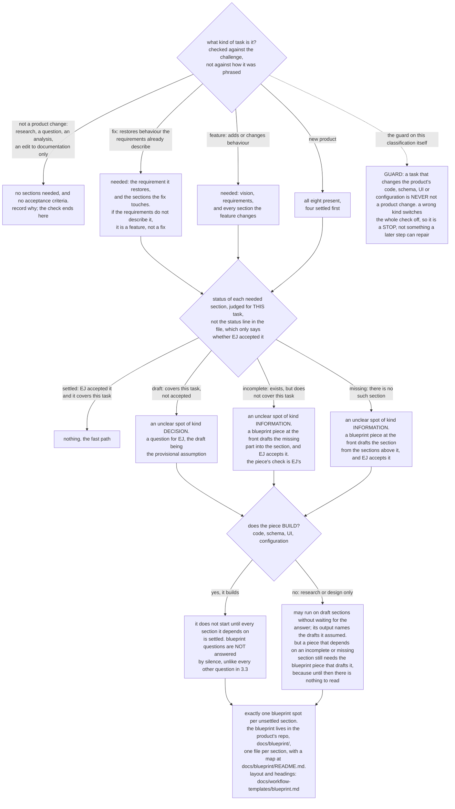
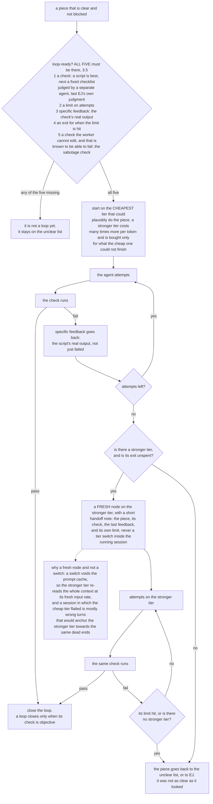
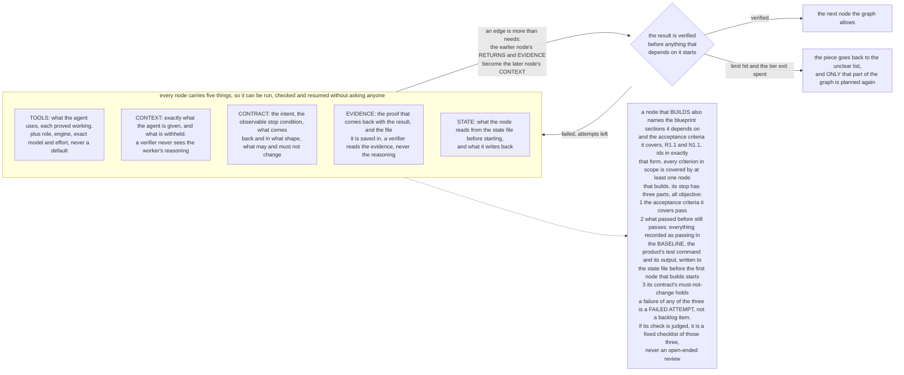

# The workflow-design algorithm, in diagrams

Drawn 2026-10-01 from `docs/WORKFLOW_DESIGN_METHOD.md` and `.claude/skills/workflow-design/SKILL.md`. This file
changes nothing about the method; it is the same algorithm as a picture. Section numbers refer to the method (3.0 …
3.7); the skill numbers its steps 1 … 8, with the restatement before them, and the mapping is at the end.

This is the folder's own subject. Per `CLAUDE.md`, designing workflows is what this folder is for, and the Ancient
Games code serves that purpose. Diagram 5 says exactly what the method takes from that code — vocabulary and one
number, nothing more.

---

## 1. The whole algorithm

```mermaid
flowchart TD
  A["a challenge arrives"] --> R0["0 UNDERSTAND THE CHALLENGE, 3.0<br/>from the challenge text alone, no tools, no agents:<br/>OBJECTIVE — what is true when done; IN SCOPE; OUT OF SCOPE.<br/>then the SIX WHYS, each feeding a design field:<br/>why wanted · why now · why this shape · why would it fail ·<br/>why stop here · why believe it's done. a ceiling, never a target.<br/>end with a PROVISIONAL CATEGORY (multi-label, inferred, TASK_TYPES.md):<br/>a guess for the tiny test and a first lookup; 3.2 relabels it.<br/>a part you cannot write, or two readings,<br/>is the first UNCLEAR SPOT (decision)"]
  R0 --> B{"method 2: is it tiny?<br/>the RESTATED problem, fix and check<br/>one sentence each, and being wrong<br/>would show itself at once"}
  B -->|"yes"| PF["fill in prompt-file.md, or just do the task.<br/>a process that costs more than the task<br/>is a failure of the method, not a success"]
  B -->|"no"| S1["1 READINESS, 3.1<br/>tools, each proved by running it, not assumed<br/>skills that already cover part of the work<br/>information: is it there, in what structure,<br/>verified against its source, readable by whom"]
  S1 --> BP["the BLUEPRINT CHECK, 3.1<br/>diagram 2: the fixed target a run can end against"]
  BP --> MISS{"anything missing<br/>or unverified?"}
  MISS -->|"yes"| PREP["a preparation piece at the front of the flow.<br/>each task leaves the knowledge better<br/>structured than it found it"]
  MISS -->|"no"| S2
  PREP --> S2["2 WRITE THE ALGORITHM, 3.2<br/>the steps that would solve the task.<br/>a step is one action with a result that can be checked.<br/>then LABEL THE PIECES: group steps into pieces that each end in one<br/>deliverable, give each a TASK_TYPES.md category (replaces the guess).<br/>touches product code → never read-only; a wrong label is a STOP and replan.<br/>a label is NOT a node: same-engine pieces with no independent<br/>check between them merge into one main-agent session"]
  S2 --> SPOT{"does every step write clearly,<br/>and can you name its check?"}
  SPOT -->|"a step does not"| U["an UNCLEAR SPOT.<br/>a step with no check you can name counts<br/>as unclear, however tidy it looks"]
  SPOT -->|"all of them do"| S3
  U --> S3["3 LIST EVERY SPOT BEFORE RESOLVING ANY, 3.3<br/>kind, what it blocks, what it depends on.<br/>listing first matters: one answer often<br/>removes another spot"]
  S3 --> K{"kind of spot?"}
  K -->|"missing information"| RES["a research piece"]
  K -->|"a decision"| ASK["one batch of questions to EJ,<br/>each with a provisional assumption<br/>so it can be answered in a few words"]
  K -->|"unknown"| EXP["a bounded explore loop"]
  RES --> JOIN["a joining step compares answers resolved separately.<br/>a contradiction is a STOP:<br/>pick one and say why, never average"]
  ASK --> JOIN
  EXP --> JOIN
  JOIN --> S4{"4 SIZE, 3.4<br/>up to 3 steps, and nothing unclear<br/>except decisions that have a default?"}
  S4 -->|"yes"| PF2["a prompt file, questions at the top.<br/>risk is judged separately from size:<br/>tiny but risky gets one independent check"]
  S4 -->|"more than 3 steps"| SPLIT["consider a new piece. split only if each part<br/>keeps its own check AND the split changes<br/>how the work is done"]
  S4 -->|"a spot of kind information or unknown,<br/>or a blueprint section missing or incomplete"| DESIGN["a workflow design, always"]
  SPLIT --> S5
  DESIGN --> DF["DEFAULT-FIRST, 3.4<br/>each piece's category row or pipeline in TASK_TYPES.md supplies<br/>pattern, engine, check, sabotage. a CHALLENGER design replaces it<br/>only on a written ≥20%-lower-projected-cost claim AT EQUAL COVERAGE<br/>(coverage is a gate, never an axis). reviewed by design_gate.py (script)<br/>+ one blind checklist pass (sonnet 5.5; different kind when it builds).<br/>every run reconciles its claim in TASK_TYPES_LEDGER.md — n=0 until it fills"]
  DF --> S5["5 CLEAR PIECES RUN AS LOOPS, 3.5<br/>diagram 3. they run WHILE the unclear<br/>spots are still being resolved"]
  S3 -.->|"pieces already clear and not blocked<br/>start here, without waiting"| S5
  S5 --> S6["6 THE REST IS A GRAPH, 3.6<br/>nodes are right-sized pieces, a node may hold its own loop<br/>edges are: this piece needs that piece's result<br/>a result is verified before anything that depends on it starts<br/>branches meet at a joining node. diagram 4"]
  S6 --> S7["7 SEQUENTIAL FIRST, 3.7<br/>read the state file, do one step, write the state back.<br/>parallel is the LAST decision: all five independence<br/>tests must hold, and it buys only clock time"]
  S7 --> S8["8 THE RUN ENDS AT THE ACCEPTANCE CRITERIA, 3.6<br/>a node that builds names its blueprint sections and its R/N ids.<br/>its stop has three parts, all objective.<br/>anything else found goes to the product's<br/>docs/blueprint/backlog.md with the date and the run id,<br/>never into this run. this is what lets a run end"]
  S8 --> OUT["output: workflow-design.md, state.md, readiness.md<br/>in runs/ID/, plus the questions batch and a cost estimate<br/>to EJ BEFORE anything is run"]
  OUT --> SCHED["the design's edges decide who works next:<br/>a Workflow script, or the COO following the graph.<br/>a node's role subagents never choose the next node"]
```

---

## 2. The blueprint check (3.1)

Added 2026-09-25, after EJ found that several projects never ended: their workflows built without a fixed target, so
every verify or review step could find more to do. **Not yet tried on a real challenge; n=0.**

The eight sections, and whose decision each is:

| # | Section | Whose decision |
|---|---|---|
| 1 | Product vision | EJ's. An agent may only write down what EJ has said |
| 2 | Core requirements, each with checkable acceptance criteria | EJ's. An agent may draft from the vision |
| 3 | Domain model | drafted by an agent from 1–2, accepted by EJ |
| 4 | Business logic | drafted by an agent from 2–3, accepted by EJ |
| 5 | System architecture | drafted by an agent from 2–4 and 8, accepted by EJ |
| 6 | Data model, schema design and its decisions | drafted by an agent from 3–5, accepted by EJ |
| 7 | UI / UX design | drafted by an agent from 2–4, accepted by EJ |
| 8 | Non-functional requirements | EJ's. An agent may draft from the vision |

Each section traces to the sections it is drawn from: a line that serves nothing above it is a finding, not a feature.

---

## 3. A clear piece as a loop, and its tier exit (3.5)

The tier exit was added 2026-09-22 at EJ's request; **n=0**. The loop rule itself is n=1, and the one trial is the
reason for it: a planner/critic loop whose check was "try to reject it" ran three rounds, 6 then 5 then 4 problems,
and never closed (`20260919-plan-critic-issues.md`).

---

## 4. A node, an edge, and the three-part stop (3.6)

---

## 5. What these diagrams take from the framework, and what they do not

The method borrows **names** from `ancient_games/`, and one **number**. There is no code path between them: nothing
in `.claude/workflows/` imports or calls the framework, and the skill never names its five algorithms.

| Node carries | Borrowed from Ancient Games | Where |
|---|---|---|
| Context | `KNOWN_FACTS`, `READ_SCOPE.deny` | `ancient_games/schema.py` |
| Contract | `INTENT`, `STOP`, `OUTPUT`, `SCOPE` | `ancient_games/schema.py` |
| Evidence | `CLAIMS`, `VERIFY_OUTPUT`, `NOT_ESTABLISHED` | the return contract, `SPEC.md` §6 |
| State | the journal, read before every step | `ancient_games/journal.py` |
| Tools, and the graph itself | nothing | — |

The number is **3**, and it is anchored in code, not chosen: Gate splits capability lists over three
(`ancient_games/stages.py:109`) and the plan-wide cap of 3 dispatched corroborating sources (`ancient_games/registry.py:24`, used at `stages.py:309`; it caps dispatches per plan, not agents running at once — corrected 2026-10-03).

The framework's five algorithms (C Gate, D Guard, B Corroborate, E Filter, A Prove — `SPEC.md` §4) are **run-time**
decision procedures inside one governed task. This method is a **design-time** procedure that runs before any agent
is dispatched and produces a document. The framework does not choose graph versus loop versus swarm, sequential
versus parallel, or a communication mechanism — `20260919-state.md` establishes that, with the code references. This
method is the answer at the level of documents, not of code. Note the overloaded word: in `SPEC.md` §4 "the five
algorithms" means C/D/B/E/A; in step 2 above, "write the algorithm" means write the steps that would solve the task.

---

## 6. How much of this has been run

| Part | Evidence | n |
|---|---|---|
| Steps 1–7 as a whole | `runs/20260920-readme-test-count/` (intake trial 1, design only, ~309k tokens for a one-line README fix — the size rule was wrong and was changed because of it), `runs/20260921-ablation7/` (designed **and executed** end to end: 6 pieces, blind verifier, join, pre-registration, and a final "what is missing" pass that retracted the run's own headline), `runs/20260930-blueprint-review/` (designed, nothing run, blocked on Q1) | 3 designs, 1 executed |
| The loop rule and its objective check | `20260919-plan-critic-issues.md`: the planner/critic loop that never closed | 1 |
| The restatement step (3.0) | added 2026-10-01 at EJ's request; not encoded in intake.js yet (`TODO.md`) | **0** |
| Task types, the 20% rule, the design gate | added 2026-10-01 at EJ's request; `design_gate.py` + 16-prompt corpus green offline | **0** |
| The tier exit (3.5) | added 2026-09-22, after ablation 7 ran | **0** |
| The blueprint check (3.1, diagram 2) | added 2026-09-25, after ablation 7 ran | **0** |
| Executor kinds, models, the COO contract | `docs/EXECUTOR_KINDS.md`, 2026-09-29/30 | **0** |

The method's own header still says it "has been tried on nothing yet … (n=1)". That was true when it was written on
2026-09-20; `runs/20260921-ablation7/` postdates it and was executed. The n=0 rows above are unaffected — all three
were added after that run.

Runnable form of steps 1–4: `.claude/workflows/intake.js`, args `{challenge, runId}`, one agent per step, fixed
yes/no checks in script code, writes only under `runs/<runId>/`. Offline test: `node tests/workflows/intake_harness.mjs`.
It is a multi-agent run, so it is used only when EJ asks for it.

---

## Step numbering: method versus skill

| Diagram | `docs/WORKFLOW_DESIGN_METHOD.md` | `.claude/skills/workflow-design/SKILL.md` |
|---|---|---|
| 1, top | 3.0 understand the challenge (six whys, provisional category), §2's tiny test reads it | "First: understand the challenge", then "Then: is it tiny?" |
| 1 | 3.1 readiness, 3.2 algorithm and piece labels, 3.3 spots, 3.4 size, 3.5 loops, 3.6 graph, 3.7 sequential first | steps 1–7, same order |
| 1, at DESIGN | 3.4 "Default-first design" and the 20% ledger | step 4's default-first sentences; `references/task-types.md` |
| 1, bottom | 3.6, the node that builds, the baseline, the backlog | step 8, "the run ends at the acceptance criteria" |
| 2 | 3.1, "Blueprint check — part of readiness" | inside step 1 |
| 3 | 3.5 | step 5 |
| 4 | 3.6, the five-things table | "Every node carries five things" |

The diagrams were written from the documents above and checked against them; they were not render-verified (no
mermaid renderer on this machine). If a diagram disagrees with the method, the method wins and the diagram is wrong.
